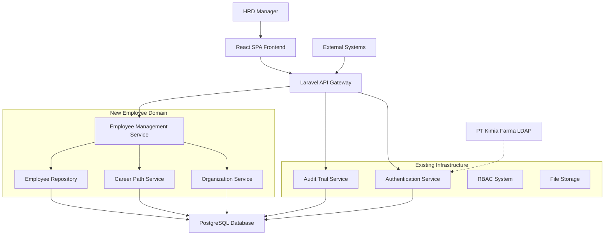
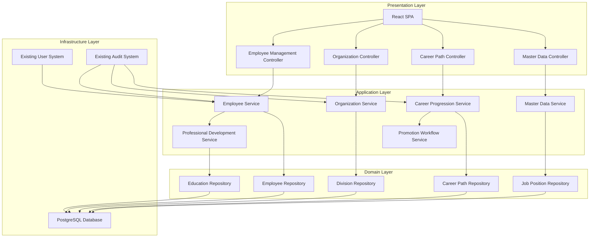
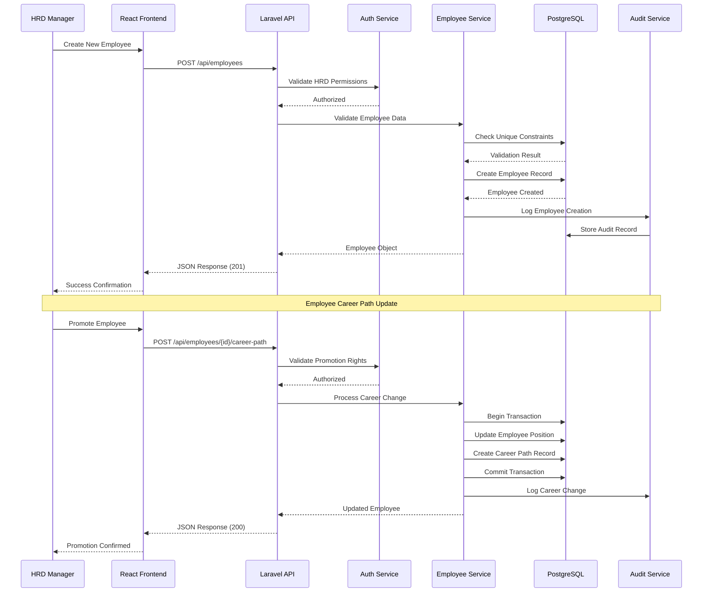

# KAEF HRIS Employee Master Data Architecture Document

## Introduction

This document outlines the overall project architecture for KAEF HRIS Employee Master Data, including backend systems, shared services, and non-UI specific concerns. Its primary goal is to serve as the guiding architectural blueprint for AI-driven development, ensuring consistency and adherence to chosen patterns and technologies.

**Relationship to Frontend Architecture:**
If the project includes a significant user interface, a separate Frontend Architecture Document will detail the frontend-specific design and MUST be used in conjunction with this document. Core technology stack choices documented herein (see "Tech Stack") are definitive for the entire project, including any frontend components.

### Starter Template or Existing Project

From the brownfield architecture analysis, this project is built on an existing Laravel 9.19 + React 18.3 codebase (originally "Luminakra Sample App"). The project already has:

- **Existing Laravel Backend**: Complete authentication system with Passport/Sanctum, RBAC, audit trails, user management
- **React Frontend**: TypeScript-based SPA with TanStack Query, Radix UI, TailwindCSS
- **Database**: PostgreSQL with existing migrations for users, roles, permissions, audit trails
- **Development Setup**: Vite build system, Docker configuration, established patterns

**Architectural Constraint**: We must build the Employee Master Data system as an extension of this existing architecture, leveraging current patterns while maintaining separation between User (authentication) and Employee (business data) concerns.

This foundation provides significant advantages including mature authentication, established UI patterns, and proven scalability, but constrains us to Laravel/React ecosystem choices.

### Change Log

| Date       | Version | Description                 | Author  |
| ---------- | ------- | --------------------------- | ------- |
| 2025-09-29 | 1.0     | Initial architecture design | Winston |

## High Level Architecture

### Technical Summary

The KAEF HRIS Employee Master Data system extends the existing Laravel/React monolith architecture with dedicated employee management capabilities. The system maintains API-first design principles using Laravel's REST API with React SPA frontend, leveraging existing PostgreSQL database and RBAC systems. Core architectural patterns include Repository pattern for data access, Service layer for business logic, and Resource transformers for API consistency. The architecture supports PT Kimia Farma's complex organizational structure through hierarchical data modeling and role-based access controls, designed to handle 10,000+ employee records with optimized database indexing and caching strategies.

### High Level Overview

1. **Architectural Style**: Monolithic Laravel API + React SPA (extending existing brownfield system)
2. **Repository Structure**: Monorepo continuation - single repository with backend/frontend integration via Vite
3. **Service Architecture**: Monolithic with clear domain separation between authentication (existing) and employee management (new)
4. **Primary Flow**: HRD managers authenticate via existing system → Access employee management dashboard → Perform CRUD operations on employee data → View organizational hierarchies and career paths
5. **Key Decisions**:
   - Extend existing User/Role system rather than rebuild authentication
   - Create separate Employee entity linked to User accounts for data separation
   - Leverage existing audit trail system for employee data changes
   - Use established Laravel API patterns (FormRequests, Resources, Controllers)
   - Maintain React frontend patterns with TanStack Query for state management

### High Level Project Diagram



### Architectural and Design Patterns

- **Clean Architecture Pattern:** Domain-driven layers with clear dependency inversion - _Rationale:_ Separates business logic from infrastructure concerns, enables testing and maintains code clarity for complex HR business rules
- **Repository Pattern:** Data access abstraction for Employee domain entities - _Rationale:_ Maintains testability while following existing codebase patterns
- **Service Layer Pattern:** Application services orchestrating use cases - _Rationale:_ Encapsulates business workflows like career progression and organizational management
- **API Resource Pattern:** Consistent JSON response formatting using Laravel API Resources - _Rationale:_ Maintains existing API consistency and enables frontend optimization

## Tech Stack

### Cloud Infrastructure

- **Provider:** Dockerized VPS deployment
- **Key Services:** Docker containers (web, database, nginx), persistent volume storage
- **Deployment Regions:** Indonesia-based VPS for data sovereignty

### Technology Stack Table

| Category               | Technology             | Version     | Purpose                    | Rationale                                                              |
| ---------------------- | ---------------------- | ----------- | -------------------------- | ---------------------------------------------------------------------- |
| **Language**           | PHP                    | 8.0.2+      | Backend development        | Maintain existing version, proven stable in current system             |
| **Runtime**            | PHP-FPM                | 8.0.2+      | PHP process manager        | Production-ready with Docker containerization                          |
| **Framework**          | Laravel                | 9.19        | Backend API framework      | Established in codebase, extensive ecosystem for HRIS features         |
| **Frontend Language**  | TypeScript             | 5.3.3       | Frontend development       | Established, provides type safety for complex employee data structures |
| **Frontend Runtime**   | Node.js                | 20.11.0 LTS | Build tooling              | Stable LTS for Vite build system                                       |
| **Frontend Framework** | React                  | 18.3.1      | UI library                 | Established in codebase with TanStack Query integration                |
| **Database**           | PostgreSQL             | 14+         | Primary database           | Established, excellent for relational employee/org data                |
| **Containerization**   | Docker                 | Latest      | Application deployment     | Enable consistent VPS deployment and environment isolation             |
| **Web Server**         | Nginx                  | Latest      | Reverse proxy/static files | Standard production setup for Laravel applications                     |
| **ORM**                | Laravel Eloquent       | 9.19        | Database abstraction       | Integrated with Laravel, supports complex relationships                |
| **Authentication**     | Laravel Passport       | 12.3        | API authentication         | Established OAuth2 implementation                                      |
| **Session Auth**       | Laravel Sanctum        | 2.14.1      | SPA authentication         | Established for React SPA integration                                  |
| **Authorization**      | Laravel Gates/Policies | 9.19        | RBAC implementation        | Extends existing role-based system                                     |
| **API Validation**     | Laravel Form Requests  | 9.19        | Input validation           | Established pattern, type-safe validation                              |
| **API Resources**      | Laravel API Resources  | 9.19        | Response formatting        | Established for consistent JSON responses                              |
| **Frontend State**     | TanStack Query         | 5.59.8      | Server state management    | Established, excellent for employee data caching                       |
| **UI Components**      | Radix UI               | Various     | Accessible components      | Established component library                                          |
| **Styling**            | TailwindCSS            | 3.4.13      | Utility-first CSS          | Established design system                                              |
| **Build Tool**         | Vite                   | 5.4.8       | Frontend build             | Established with Laravel plugin                                        |
| **Testing Backend**    | PHPUnit                | 9.5.10      | Backend testing            | Established, will extend coverage                                      |
| **Code Quality**       | Laravel Pint           | Latest      | PHP formatting             | Established code formatting                                            |
| **Code Quality**       | ESLint + Prettier      | Latest      | JS/TS quality              | Established frontend quality tools                                     |

## Data Models

### Employee

**Purpose:** Core employee business entity separate from authentication concerns, containing comprehensive professional and personal information for PT Kimia Farma staff across all divisions and subsidiaries.

**Key Attributes:**

- employee_id: string (unique identifier, e.g., "KF2024001") - Business identifier separate from database ID
- user_id: foreign key (nullable) - Links to authentication User when employee has system access
- employee_number: string (unique) - PT Kimia Farma internal employee number
- full_name: string - Complete legal name per Indonesian employment records
- preferred_name: string (nullable) - Preferred display name for workplace use
- email: string (unique) - Professional email address
- phone: string - Primary contact number
- employment_status: enum - active, inactive, terminated, on_leave, probation, contract, suspended
- employment_type: enum - permanent, contract, intern, consultant
- hire_date: date - Employment start date
- termination_date: date (nullable) - Employment end date if applicable
- birth_date: date - Date of birth for age calculations
- national_id: string (unique) - Indonesian KTP number
- tax_id: string (nullable) - NPWP number for tax purposes
- emergency_contact_name: string - Emergency contact person
- emergency_contact_phone: string - Emergency contact number
- address: text - Current residential address
- photo_url: string (nullable) - Employee photo for identification

**Relationships:**

- belongsTo User (nullable) - Authentication account link
- belongsTo Division - Organizational division assignment
- belongsTo JobPosition - Current job position
- belongsTo Employee as manager - Direct supervisor relationship
- hasMany EmployeeEducation - Education history records
- hasMany EmployeeCertification - Professional certifications
- hasMany EmployeeLicense - Professional licenses
- hasMany CareerPath - Career progression history
- hasMany AuditTrail - Change tracking integration

### Division

**Purpose:** Represents PT Kimia Farma's actual organizational structure including business units, subsidiaries, and departmental hierarchy to support proper employee assignment and reporting.

**Key Attributes:**

- division_code: string (unique) - Business code (e.g., "MFG", "DIST", "RETAIL")
- division_name: string - Full division name
- division_type: enum - business_unit, subsidiary, department, section
- parent_division_id: foreign key (nullable) - Hierarchical organization support
- subsidiary_company: string (nullable) - Legal entity name for subsidiaries
- location: string - Primary location/address
- is_active: boolean - Whether division is currently operational
- head_employee_id: foreign key (nullable) - Division head/manager

**Relationships:**

- belongsTo Division as parent - Hierarchical structure
- hasMany Division as children - Sub-divisions
- hasMany Employee - Employees assigned to division
- belongsTo Employee as head - Division manager

### JobPosition

**Purpose:** Defines career positions within PT Kimia Farma's pharmaceutical industry context, supporting career path progression and organizational hierarchy.

**Key Attributes:**

- position_code: string (unique) - Standard position code
- position_title: string - Job title
- position_level: integer - Career level for progression tracking
- position_category: enum - executive, managerial, supervisory, specialist, staff, support
- department: string - Functional department (HR, Manufacturing, Sales, etc.)
- is_managerial: boolean - Whether position has direct reports
- min_education_level: enum - Required minimum education
- required_certifications: text (nullable) - Required professional certifications
- is_active: boolean - Whether position is currently available

**Relationships:**

- hasMany Employee - Employees in this position
- hasMany CareerPath - Career progression records

### CareerPath

**Purpose:** Tracks employee career progression, promotions, transfers, and position changes within PT Kimia Farma to support career development and organizational planning.

**Key Attributes:**

- employee_id: foreign key - Employee reference
- from_position_id: foreign key (nullable) - Previous position
- to_position_id: foreign key - New position
- from_division_id: foreign key (nullable) - Previous division
- to_division_id: foreign key - New division
- change_type: enum - promotion, transfer, demotion, lateral_move, new_hire
- effective_date: date - When change took effect
- reason: text - Reason for position change
- approved_by: foreign key - Manager who approved change
- salary_change: decimal (nullable) - Salary adjustment amount
- notes: text (nullable) - Additional comments

**Relationships:**

- belongsTo Employee - Career owner
- belongsTo JobPosition as fromPosition - Previous role
- belongsTo JobPosition as toPosition - New role
- belongsTo Division as fromDivision - Previous division
- belongsTo Division as toDivision - New division
- belongsTo Employee as approver - Approving manager

## Components

### Employee Management Service

**Responsibility:** Core employee lifecycle management, profile operations, and data validation for PT Kimia Farma's employee master data system.

**Key Interfaces:**

- `EmployeeController` - REST API endpoints for employee CRUD operations
- `EmployeeService` - Business logic for employee operations and validation
- `EmployeeRepository` - Data access abstraction for employee entities
- `EmployeeResource` - API response formatting for employee data

**Dependencies:** User authentication system, Division service, Audit trail service

**Technology Stack:** Laravel Controllers, Services, Eloquent repositories, API Resources with Form Request validation

### Organization Management Service

**Responsibility:** PT Kimia Farma organizational structure management including divisions, subsidiaries, and hierarchical relationships.

**Key Interfaces:**

- `DivisionController` - REST API for organizational structure operations
- `OrganizationService` - Business logic for hierarchical operations and validation
- `DivisionRepository` - Data access for division and organizational data
- `OrganizationHierarchyService` - Complex hierarchy traversal and validation

**Dependencies:** Employee service for manager assignments, RBAC system for access control

**Technology Stack:** Laravel Controllers with nested resource routes, Services for hierarchy logic, Eloquent with recursive relationships

### Career Path Management Service

**Responsibility:** Employee career progression tracking, promotion workflows, and career development analytics within pharmaceutical industry context.

**Key Interfaces:**

- `CareerPathController` - REST API for career tracking and promotion management
- `CareerProgressionService` - Business logic for career moves and validation
- `CareerPathRepository` - Data access for career history and progression
- `PromotionWorkflowService` - Approval workflows for position changes

**Dependencies:** Employee service, Organization service, Job position management

**Technology Stack:** Laravel Controllers, Services with workflow logic, Eloquent relationships for complex career tracking

### Master Data Management Service

**Responsibility:** Configuration and management of HRIS master data including job positions, employment types, and system parameters for HRD managers.

**Key Interfaces:**

- `JobPositionController` - REST API for position management
- `MasterDataService` - Business logic for configurable parameters
- `JobPositionRepository` - Data access for position and configuration data
- `ConfigurationController` - System parameter management

**Dependencies:** Organization service for position-division relationships, RBAC for configuration access

**Technology Stack:** Laravel Controllers with resource patterns, Services for validation logic, Configuration management

### Employee Education & Certification Service

**Responsibility:** Professional development tracking including education history, certifications, and license management with expiry notifications.

**Key Interfaces:**

- `EducationController` - REST API for education history management
- `CertificationController` - REST API for certification and license tracking
- `ProfessionalDevelopmentService` - Business logic for education validation
- `ExpiryTrackingService` - Certification and license expiry management

**Dependencies:** Employee service for record ownership, Notification service for expiry alerts

**Technology Stack:** Laravel Controllers, Services with date validation, Eloquent relationships for education tracking

### Component Diagrams



## External APIs

Based on the PRD requirements and PT Kimia Farma's pharmaceutical industry context, the system currently focuses on internal employee management without external API integrations.

**No External APIs Required Initially** - The Employee Master Data system operates as an internal HRIS module using existing authentication and audit infrastructure. External integrations will be planned for future phases based on PT Kimia Farma's specific integration requirements.

## Core Workflows



## Database Schema

```sql
-- Employees table (core employee master data)
CREATE TABLE employees (
    id BIGSERIAL PRIMARY KEY,
    employee_id VARCHAR(50) UNIQUE NOT NULL,
    user_id BIGINT REFERENCES users(id) ON DELETE SET NULL,
    employee_number VARCHAR(50) UNIQUE NOT NULL,
    full_name VARCHAR(255) NOT NULL,
    preferred_name VARCHAR(255),
    email VARCHAR(255) UNIQUE NOT NULL,
    phone VARCHAR(50) NOT NULL,
    employment_status VARCHAR(20) NOT NULL CHECK (employment_status IN ('active', 'inactive', 'terminated', 'on_leave', 'probation', 'contract', 'suspended')),
    employment_type VARCHAR(20) NOT NULL CHECK (employment_type IN ('permanent', 'contract', 'intern', 'consultant')),
    hire_date DATE NOT NULL,
    termination_date DATE,
    birth_date DATE NOT NULL,
    national_id VARCHAR(50) UNIQUE,
    tax_id VARCHAR(50),
    emergency_contact_name VARCHAR(255),
    emergency_contact_phone VARCHAR(50),
    address TEXT,
    photo_url VARCHAR(500),
    division_id BIGINT NOT NULL REFERENCES divisions(id),
    job_position_id BIGINT NOT NULL REFERENCES job_positions(id),
    manager_id BIGINT REFERENCES employees(id) ON DELETE SET NULL,
    created_at TIMESTAMP DEFAULT CURRENT_TIMESTAMP,
    updated_at TIMESTAMP DEFAULT CURRENT_TIMESTAMP,
    deleted_at TIMESTAMP
);

-- Divisions table (organizational structure)
CREATE TABLE divisions (
    id BIGSERIAL PRIMARY KEY,
    division_code VARCHAR(20) UNIQUE NOT NULL,
    division_name VARCHAR(255) NOT NULL,
    division_type VARCHAR(20) NOT NULL CHECK (division_type IN ('business_unit', 'subsidiary', 'department', 'section')),
    parent_division_id BIGINT REFERENCES divisions(id) ON DELETE SET NULL,
    subsidiary_company VARCHAR(255),
    location VARCHAR(500),
    is_active BOOLEAN DEFAULT TRUE,
    head_employee_id BIGINT REFERENCES employees(id) ON DELETE SET NULL,
    created_at TIMESTAMP DEFAULT CURRENT_TIMESTAMP,
    updated_at TIMESTAMP DEFAULT CURRENT_TIMESTAMP,
    deleted_at TIMESTAMP
);

-- Job positions table
CREATE TABLE job_positions (
    id BIGSERIAL PRIMARY KEY,
    position_code VARCHAR(20) UNIQUE NOT NULL,
    position_title VARCHAR(255) NOT NULL,
    position_level INTEGER NOT NULL,
    position_category VARCHAR(20) NOT NULL CHECK (position_category IN ('executive', 'managerial', 'supervisory', 'specialist', 'staff', 'support')),
    department VARCHAR(100),
    is_managerial BOOLEAN DEFAULT FALSE,
    min_education_level VARCHAR(20),
    required_certifications TEXT,
    is_active BOOLEAN DEFAULT TRUE,
    created_at TIMESTAMP DEFAULT CURRENT_TIMESTAMP,
    updated_at TIMESTAMP DEFAULT CURRENT_TIMESTAMP,
    deleted_at TIMESTAMP
);

-- Career path tracking
CREATE TABLE career_paths (
    id BIGSERIAL PRIMARY KEY,
    employee_id BIGINT NOT NULL REFERENCES employees(id) ON DELETE CASCADE,
    from_position_id BIGINT REFERENCES job_positions(id),
    to_position_id BIGINT NOT NULL REFERENCES job_positions(id),
    from_division_id BIGINT REFERENCES divisions(id),
    to_division_id BIGINT NOT NULL REFERENCES divisions(id),
    change_type VARCHAR(20) NOT NULL CHECK (change_type IN ('promotion', 'transfer', 'demotion', 'lateral_move', 'new_hire')),
    effective_date DATE NOT NULL,
    reason TEXT,
    approved_by BIGINT REFERENCES employees(id),
    salary_change DECIMAL(15,2),
    notes TEXT,
    created_at TIMESTAMP DEFAULT CURRENT_TIMESTAMP,
    updated_at TIMESTAMP DEFAULT CURRENT_TIMESTAMP
);

-- Employee education history
CREATE TABLE employee_education_history (
    id BIGSERIAL PRIMARY KEY,
    employee_id BIGINT NOT NULL REFERENCES employees(id) ON DELETE CASCADE,
    institution_name VARCHAR(255) NOT NULL,
    degree_level VARCHAR(50) NOT NULL,
    field_of_study VARCHAR(255),
    graduation_year INTEGER,
    gpa DECIMAL(3,2),
    is_verified BOOLEAN DEFAULT FALSE,
    created_at TIMESTAMP DEFAULT CURRENT_TIMESTAMP,
    updated_at TIMESTAMP DEFAULT CURRENT_TIMESTAMP
);

-- Employee certifications
CREATE TABLE employee_certifications (
    id BIGSERIAL PRIMARY KEY,
    employee_id BIGINT NOT NULL REFERENCES employees(id) ON DELETE CASCADE,
    certification_name VARCHAR(255) NOT NULL,
    issuing_organization VARCHAR(255) NOT NULL,
    issue_date DATE NOT NULL,
    expiry_date DATE,
    certification_number VARCHAR(100),
    is_active BOOLEAN DEFAULT TRUE,
    created_at TIMESTAMP DEFAULT CURRENT_TIMESTAMP,
    updated_at TIMESTAMP DEFAULT CURRENT_TIMESTAMP
);

-- Employee professional licenses
CREATE TABLE employee_professional_licenses (
    id BIGSERIAL PRIMARY KEY,
    employee_id BIGINT NOT NULL REFERENCES employees(id) ON DELETE CASCADE,
    license_name VARCHAR(255) NOT NULL,
    license_number VARCHAR(100) NOT NULL,
    issuing_authority VARCHAR(255) NOT NULL,
    issue_date DATE NOT NULL,
    expiry_date DATE NOT NULL,
    license_status VARCHAR(20) DEFAULT 'active' CHECK (license_status IN ('active', 'expired', 'suspended', 'revoked')),
    created_at TIMESTAMP DEFAULT CURRENT_TIMESTAMP,
    updated_at TIMESTAMP DEFAULT CURRENT_TIMESTAMP
);

-- Performance indexes for optimal query performance
CREATE INDEX idx_employees_employment_status ON employees(employment_status);
CREATE INDEX idx_employees_division_id ON employees(division_id);
CREATE INDEX idx_employees_manager_id ON employees(manager_id);
CREATE INDEX idx_employees_email ON employees(email);
CREATE INDEX idx_employees_employee_number ON employees(employee_number);
CREATE INDEX idx_employees_full_name ON employees(full_name);

CREATE INDEX idx_divisions_parent_division_id ON divisions(parent_division_id);
CREATE INDEX idx_divisions_division_code ON divisions(division_code);
CREATE INDEX idx_divisions_is_active ON divisions(is_active);

CREATE INDEX idx_career_paths_employee_id ON career_paths(employee_id);
CREATE INDEX idx_career_paths_effective_date ON career_paths(effective_date);

CREATE INDEX idx_employee_education_employee_id ON employee_education_history(employee_id);
CREATE INDEX idx_employee_certifications_employee_id ON employee_certifications(employee_id);
CREATE INDEX idx_employee_certifications_expiry_date ON employee_certifications(expiry_date);
CREATE INDEX idx_employee_licenses_employee_id ON employee_professional_licenses(employee_id);
CREATE INDEX idx_employee_licenses_expiry_date ON employee_professional_licenses(expiry_date);
```

## Source Tree

```text
kaef-hris/
├── app/
│   ├── Http/
│   │   ├── Controllers/
│   │   │   ├── Api/
│   │   │   │   ├── EmployeeController.php          # Employee CRUD operations
│   │   │   │   ├── DivisionController.php          # Organizational structure
│   │   │   │   ├── CareerPathController.php        # Career progression
│   │   │   │   ├── JobPositionController.php       # Master data management
│   │   │   │   ├── EducationController.php         # Education history
│   │   │   │   └── CertificationController.php     # Certifications & licenses
│   │   ├── Requests/
│   │   │   ├── Employee/
│   │   │   │   ├── CreateEmployeeRequest.php       # Employee creation validation
│   │   │   │   ├── UpdateEmployeeRequest.php       # Employee update validation
│   │   │   │   └── BulkEmployeeRequest.php         # Bulk operations validation
│   │   │   ├── CareerPath/
│   │   │   │   └── CreateCareerPathRequest.php     # Career change validation
│   │   │   └── Education/
│   │   │       ├── CreateEducationRequest.php      # Education entry validation
│   │   │       └── CreateCertificationRequest.php  # Certification validation
│   │   └── Resources/
│   │       ├── Employee/
│   │       │   ├── EmployeeResource.php             # Employee API response
│   │       │   ├── EmployeeDetailResource.php      # Detailed employee data
│   │       │   └── EmployeeSummaryResource.php     # List view employee data
│   │       ├── DivisionResource.php                # Division API response
│   │       ├── CareerPathResource.php              # Career history response
│   │       └── JobPositionResource.php             # Job position response
│   ├── Models/
│   │   ├── Employee.php                            # Employee Eloquent model
│   │   ├── Division.php                            # Division Eloquent model
│   │   ├── JobPosition.php                         # Job position Eloquent model
│   │   ├── CareerPath.php                          # Career path Eloquent model
│   │   ├── EmployeeEducationHistory.php            # Education history model
│   │   ├── EmployeeCertification.php               # Certification model
│   │   └── EmployeeProfessionalLicense.php         # Professional license model
│   ├── Services/
│   │   ├── Employee/
│   │   │   ├── EmployeeService.php                 # Core employee business logic
│   │   │   ├── EmployeeSearchService.php           # Advanced search functionality
│   │   │   └── EmployeeBulkService.php             # Bulk operations service
│   │   ├── Organization/
│   │   │   ├── OrganizationService.php             # Organizational structure logic
│   │   │   └── DivisionHierarchyService.php       # Hierarchy traversal logic
│   │   ├── CareerPath/
│   │   │   ├── CareerProgressionService.php        # Career advancement logic
│   │   │   └── PromotionWorkflowService.php        # Promotion approval workflow
│   │   └── MasterData/
│   │       └── MasterDataService.php               # Configuration management
│   ├── Repositories/
│   │   ├── Employee/
│   │   │   ├── EmployeeRepository.php              # Employee data access
│   │   │   ├── EmployeeRepositoryInterface.php     # Repository contract
│   │   │   └── EloquentEmployeeRepository.php      # Eloquent implementation
│   │   ├── Division/
│   │   │   ├── DivisionRepository.php              # Division data access
│   │   │   └── DivisionRepositoryInterface.php     # Repository contract
│   │   └── CareerPath/
│   │       ├── CareerPathRepository.php            # Career path data access
│   │       └── CareerPathRepositoryInterface.php   # Repository contract
│   ├── Policies/
│   │   ├── EmployeePolicy.php                      # Employee authorization rules
│   │   ├── DivisionPolicy.php                     # Division access control
│   │   └── CareerPathPolicy.php                   # Career path permissions
│   ├── Events/
│   │   ├── Employee/
│   │   │   ├── EmployeeCreated.php                 # Employee creation event
│   │   │   ├── EmployeeUpdated.php                 # Employee update event
│   │   │   └── EmployeeStatusChanged.php           # Status change event
│   │   └── CareerPath/
│   │       └── CareerPathCreated.php               # Career change event
│   ├── Listeners/
│   │   ├── LogEmployeeActivity.php                 # Audit trail integration
│   │   └── NotifyManagerOfChanges.php              # Manager notifications
│   └── Providers/
│       └── EmployeeServiceProvider.php             # DI container bindings
├── database/
│   ├── migrations/
│   │   ├── 2024_10_01_000001_create_divisions_table.php
│   │   ├── 2024_10_01_000002_create_job_positions_table.php
│   │   ├── 2024_10_01_000003_create_employees_table.php
│   │   ├── 2024_10_01_000004_create_career_paths_table.php
│   │   ├── 2024_10_01_000005_create_employee_education_history_table.php
│   │   ├── 2024_10_01_000006_create_employee_certifications_table.php
│   │   └── 2024_10_01_000007_create_employee_professional_licenses_table.php
│   ├── seeders/
│   │   ├── DivisionSeeder.php                      # PT Kimia Farma org structure
│   │   ├── JobPositionSeeder.php                   # Standard job positions
│   │   └── EmployeeSeeder.php                      # Sample employee data
│   └── factories/
│       ├── EmployeeFactory.php                     # Employee test data factory
│       ├── DivisionFactory.php                     # Division test data factory
│       └── CareerPathFactory.php                   # Career path test data factory
├── resources/
│   ├── app/
│   │   ├── employee/                               # Employee management module
│   │   │   ├── components/
│   │   │   │   ├── EmployeeList.tsx               # Employee directory view
│   │   │   │   ├── EmployeeDetail.tsx             # Employee profile detail
│   │   │   │   ├── EmployeeForm.tsx               # Employee create/edit form
│   │   │   │   ├── EmployeeSearch.tsx             # Advanced search component
│   │   │   │   └── EmployeeFilters.tsx            # Filter controls
│   │   │   ├── pages/
│   │   │   │   ├── EmployeeIndex.tsx              # Main employee page
│   │   │   │   ├── EmployeeCreate.tsx             # Create employee page
│   │   │   │   └── EmployeeEdit.tsx               # Edit employee page
│   │   │   ├── hooks/
│   │   │   │   ├── useEmployees.ts                # Employee data fetching
│   │   │   │   ├── useEmployeeSearch.ts           # Search functionality
│   │   │   │   └── useEmployeeMutations.ts        # Create/update/delete
│   │   │   └── types/
│   │   │       └── employee.ts                    # TypeScript type definitions
│   │   ├── organization/                          # Organizational structure module
│   │   │   ├── components/
│   │   │   │   ├── OrganizationChart.tsx          # Org chart visualization
│   │   │   │   ├── DivisionTree.tsx               # Hierarchical division view
│   │   │   │   └── DivisionSelector.tsx           # Division picker component
│   │   │   ├── pages/
│   │   │   │   └── OrganizationIndex.tsx          # Organization management page
│   │   │   └── hooks/
│   │   │       └── useDivisions.ts                # Division data management
│   │   ├── career-path/                           # Career progression module
│   │   │   ├── components/
│   │   │   │   ├── CareerTimeline.tsx             # Career history visualization
│   │   │   │   ├── PromotionForm.tsx              # Promotion/transfer form
│   │   │   │   └── CareerPathChart.tsx            # Career progression chart
│   │   │   ├── pages/
│   │   │   │   └── CareerPathIndex.tsx            # Career management page
│   │   │   └── hooks/
│   │   │       └── useCareerPath.ts               # Career path data management
│   │   └── shared/
│   │       ├── components/
│   │       │   ├── DataTable.tsx                  # Reusable data table
│   │       │   ├── StatusBadge.tsx                # Status indicator component
│   │       │   └── ConfirmationDialog.tsx        # Confirmation modal
│   │       ├── hooks/
│   │       │   ├── usePermissions.ts              # RBAC permission checks
│   │       │   └── useAuditTrail.ts               # Audit log integration
│   │       └── utils/
│   │           ├── formatters.ts                  # Data formatting utilities
│   │           └── validators.ts                  # Client-side validation
├── routes/
│   └── api.php                                    # API route definitions
├── tests/
│   ├── Feature/
│   │   ├── Employee/
│   │   │   ├── EmployeeManagementTest.php         # Employee CRUD tests
│   │   │   ├── EmployeeSearchTest.php             # Search functionality tests
│   │   │   └── EmployeeBulkOperationsTest.php     # Bulk operations tests
│   │   ├── CareerPath/
│   │   │   └── CareerProgressionTest.php          # Career path tests
│   │   └── Organization/
│   │       └── OrganizationStructureTest.php      # Division hierarchy tests
│   └── Unit/
│       ├── Services/
│       │   ├── EmployeeServiceTest.php            # Employee business logic tests
│       │   ├── OrganizationServiceTest.php        # Organization logic tests
│       │   └── CareerProgressionServiceTest.php   # Career progression tests
│       └── Repositories/
│           ├── EmployeeRepositoryTest.php         # Employee data access tests
│           └── DivisionRepositoryTest.php         # Division data access tests
└── config/
    └── employee.php                               # Employee module configuration
```

## Infrastructure and Deployment

### Infrastructure as Code

- **Tool:** Docker Compose (existing configuration)
- **Location:** `docker-compose.yml` and `docker-compose.prod.yml`
- **Approach:** Container registry deployment with external proxy network

### Deployment Strategy

- **Strategy:** Container registry deployment (GitHub Packages)
- **CI/CD Platform:** GitHub Actions (inferred from ghcr.io registry)
- **Pipeline Configuration:** Build → Push to Registry → Deploy to VPS

### Environments

- **Development:** Local Docker setup with existing compose files
- **Production:** VPS with external proxy network (luminakra-codeinfra_proxy-network)

### Environment Promotion Flow

```text
Development (Local)
    ↓ (git push → GitHub Actions)
Container Registry (ghcr.io)
    ↓ (pull latest image)
Production VPS (Docker Compose)
```

### Rollback Strategy

- **Primary Method:** Container image tag rollback via registry
- **Trigger Conditions:** Health check failures in docker-compose
- **Recovery Time Objective:** Under 2 minutes (container restart time)

## Error Handling Strategy

### General Approach

- **Error Model:** Laravel Exception hierarchy with custom business exceptions
- **Exception Hierarchy:** Base EmployeeException → Specific domain exceptions (EmployeeNotFoundException, InvalidCareerPathException, etc.)
- **Error Propagation:** Controller → Service → Repository with proper exception translation at each layer

### Logging Standards

- **Library:** Laravel Log 9.19 (Monolog integration)
- **Format:** JSON structured logging with contextual information
- **Levels:** Emergency, Alert, Critical, Error, Warning, Notice, Info, Debug
- **Required Context:**
  - Correlation ID: UUID v4 format for request tracing
  - Service Context: Employee management module identification
  - User Context: Authenticated user ID and role for audit purposes

### Error Handling Patterns

#### External API Errors

- **Retry Policy:** Exponential backoff with 3 retry attempts for transient failures
- **Circuit Breaker:** Not applicable (no external APIs in initial implementation)
- **Timeout Configuration:** Database queries: 30s, File uploads: 120s
- **Error Translation:** Database constraint violations mapped to user-friendly messages

#### Business Logic Errors

- **Custom Exceptions:**
  - `EmployeeNotFoundException` - Employee lookup failures
  - `InvalidCareerPathException` - Career progression validation failures
  - `OrganizationStructureException` - Division hierarchy violations
  - `DuplicateEmployeeException` - Unique constraint violations
- **User-Facing Errors:** Standardized JSON format with error codes and user messages
- **Error Codes:** HRIS-specific prefixed codes (EMP001, ORG001, CAR001, etc.)

#### Data Consistency

- **Transaction Strategy:** Database transactions for multi-table operations (career path changes, organizational updates)
- **Compensation Logic:** Rollback mechanisms for failed promotion/transfer operations
- **Idempotency:** Employee creation and update operations designed for safe retry

## Coding Standards

### Core Standards

- **Languages & Runtimes:** PHP 8.0.2+, TypeScript 5.3+, Node.js 20.11.0 LTS
- **Style & Linting:** Laravel Pint for PHP, ESLint + Prettier for TypeScript/React
- **Test Organization:** Feature tests in `tests/Feature/Employee/`, Unit tests in `tests/Unit/Services/`

### Naming Conventions

| Element          | Convention                     | Example                           |
| ---------------- | ------------------------------ | --------------------------------- |
| Controllers      | PascalCase + Controller suffix | EmployeeController                |
| Services         | PascalCase + Service suffix    | EmployeeService                   |
| Repositories     | PascalCase + Repository suffix | EmployeeRepository                |
| Models           | PascalCase singular            | Employee, CareerPath              |
| Database Tables  | snake_case plural              | employees, career_paths           |
| API Routes       | kebab-case                     | /api/employees, /api/career-paths |
| React Components | PascalCase                     | EmployeeList, CareerTimeline      |
| TypeScript Types | PascalCase                     | EmployeeData, CareerPathEntry     |

### Critical Rules

- **Database Transactions Required:** All multi-table operations (career changes, promotions) must use DB transactions with proper rollback
- **Repository Pattern Enforcement:** Never use Eloquent models directly in controllers - always go through repository layer
- **API Resource Wrapper:** All API responses must use Laravel API Resources for consistent formatting
- **Audit Trail Integration:** Employee data changes must trigger audit events using existing audit system
- **RBAC Validation:** All employee operations must validate permissions using Laravel policies before execution
- **Input Validation:** Use Laravel Form Requests for all employee data validation - never validate in controllers
- **Error Logging Required:** Business logic exceptions must include correlation ID and user context for debugging
- **No Direct Query Building:** Use repository methods instead of raw queries or direct Eloquent query building
- **TypeScript Strict Mode:** All React components must use proper TypeScript typing - no `any` types allowed
- **TanStack Query Integration:** All server state must use TanStack Query hooks - no direct API calls in components

## Test Strategy and Standards

### Testing Philosophy

- **Approach:** Test-driven development (TDD) for critical business logic, test-after for UI components
- **Coverage Goals:** 80% code coverage for services and repositories, 60% for controllers, 40% for React components
- **Test Pyramid:** 60% unit tests, 30% integration tests, 10% feature/E2E tests

### Test Types and Organization

#### Unit Tests

- **Framework:** PHPUnit 9.5.10 with existing configuration
- **File Convention:** `{ClassName}Test.php` in `tests/Unit/` directory
- **Location:** `tests/Unit/Services/`, `tests/Unit/Repositories/`
- **Mocking Library:** PHPUnit built-in mocking with Mockery for complex scenarios
- **Coverage Requirement:** 80% minimum for business logic classes

**AI Agent Requirements:**

- Generate tests for all public methods in Services and Repositories
- Cover edge cases and error conditions (invalid employee data, constraint violations)
- Follow AAA pattern (Arrange, Act, Assert)
- Mock all external dependencies (database, audit service, external APIs)

#### Integration Tests

- **Scope:** Database interactions, service layer integration, API endpoint testing
- **Location:** `tests/Feature/Employee/`, `tests/Feature/Organization/`
- **Test Infrastructure:**
  - **Database:** In-memory SQLite for fast unit tests, PostgreSQL for integration tests
  - **Test Data:** Laravel factories and seeders for realistic test scenarios
  - **Authentication:** Sanctum token-based testing for API endpoints

#### End-to-End Tests

- **Framework:** None initially - focus on comprehensive integration testing
- **Scope:** Critical user workflows (employee creation, career progression, organizational updates)
- **Environment:** Staging environment with production-like data
- **Test Data:** Anonymized subset of PT Kimia Farma organizational structure

### Test Data Management

- **Strategy:** Laravel Model Factories with realistic PT Kimia Farma data patterns
- **Fixtures:** JSON fixtures for complex organizational hierarchies in `tests/fixtures/`
- **Factories:** `EmployeeFactory`, `DivisionFactory`, `CareerPathFactory` with relationships
- **Cleanup:** Database transactions with automatic rollback for test isolation

### Continuous Testing

- **CI Integration:** GitHub Actions pipeline with matrix testing (PHP 8.0, 8.1, 8.2)
- **Performance Tests:** Database query performance testing for 10,000+ employee scenarios
- **Security Tests:** Input validation testing and SQL injection prevention

## Security

### Input Validation

- **Validation Library:** Laravel Form Requests with custom validation rules
- **Validation Location:** API boundary validation before any business logic processing
- **Required Rules:**
  - All external inputs MUST be validated using Laravel Form Requests
  - Employee personal data (national_id, tax_id) must use Indonesian format validation
  - Whitelist approach for enum values (employment_status, employment_type)
  - File upload validation for employee photos (type, size, malware scanning)

### Authentication & Authorization

- **Auth Method:** Laravel Sanctum for SPA + existing Passport for API access
- **Session Management:** Secure session handling with existing Laravel session configuration
- **Required Patterns:**
  - All employee endpoints MUST require authentication
  - RBAC validation using Laravel Policies before any employee data access
  - HRD manager role required for cross-divisional employee access
  - Division managers limited to their own division employees only
  - Manager hierarchy validation for subordinate employee access

### Secrets Management

- **Development:** Laravel .env files with dummy values, never commit real secrets
- **Production:** Environment variables injected via Docker secrets or server configuration
- **Code Requirements:**
  - NEVER hardcode database credentials, API keys, or encryption keys
  - Access secrets only through Laravel config() helper
  - No sensitive data in logs, error messages, or API responses
  - Employee personal data (national_id, tax_id) must be masked in logs

### API Security

- **Rate Limiting:** Laravel throttle middleware (60 requests per minute per user)
- **CORS Policy:** Restrict to PT Kimia Farma domains only in production
- **Security Headers:** HTTPS enforcement, HSTS, X-Frame-Options, CSP headers
- **HTTPS Enforcement:** All employee data API calls must use HTTPS in production

### Data Protection

- **Encryption at Rest:** Laravel's encrypted database fields for sensitive PII (national_id, tax_id)
- **Encryption in Transit:** HTTPS/TLS 1.3 for all API communications
- **PII Handling:** Indonesian personal data protection compliance - mask/anonymize PII in logs and audit trails
- **Logging Restrictions:** Never log passwords, national_id, tax_id, or employee photos in plain text

### Dependency Security

- **Scanning Tool:** Composer audit for PHP dependencies, npm audit for Node.js packages
- **Update Policy:** Monthly security updates for all dependencies
- **Approval Process:** Security review required for new dependencies handling employee data

### Security Testing

- **SAST Tool:** Laravel security scanning via existing CI/CD pipeline
- **DAST Tool:** API endpoint security testing for SQL injection, XSS prevention
- **Penetration Testing:** Annual third-party security assessment of employee data handling

## Next Steps

After completing the architecture:

1. **Begin Implementation:**

   - Review with Product Owner and stakeholders
   - Start with database migrations and core models
   - Implement repository and service layers following Clean Architecture
   - Build API endpoints with proper validation and authorization
   - Develop React components with TanStack Query integration

2. **Quality Assurance:**

   - Implement comprehensive test coverage as defined in test strategy
   - Set up CI/CD pipeline integration with existing Docker infrastructure
   - Conduct security review of employee data handling

3. **Future Enhancements:**
   - Plan integration with other HRIS modules (payroll, performance management)
   - Consider Redis caching implementation for organizational structure data
   - Evaluate background job processing for bulk operations

This architecture provides a solid foundation for PT Kimia Farma's Employee Master Data system while maintaining integration with existing infrastructure and supporting future HRIS module development.
