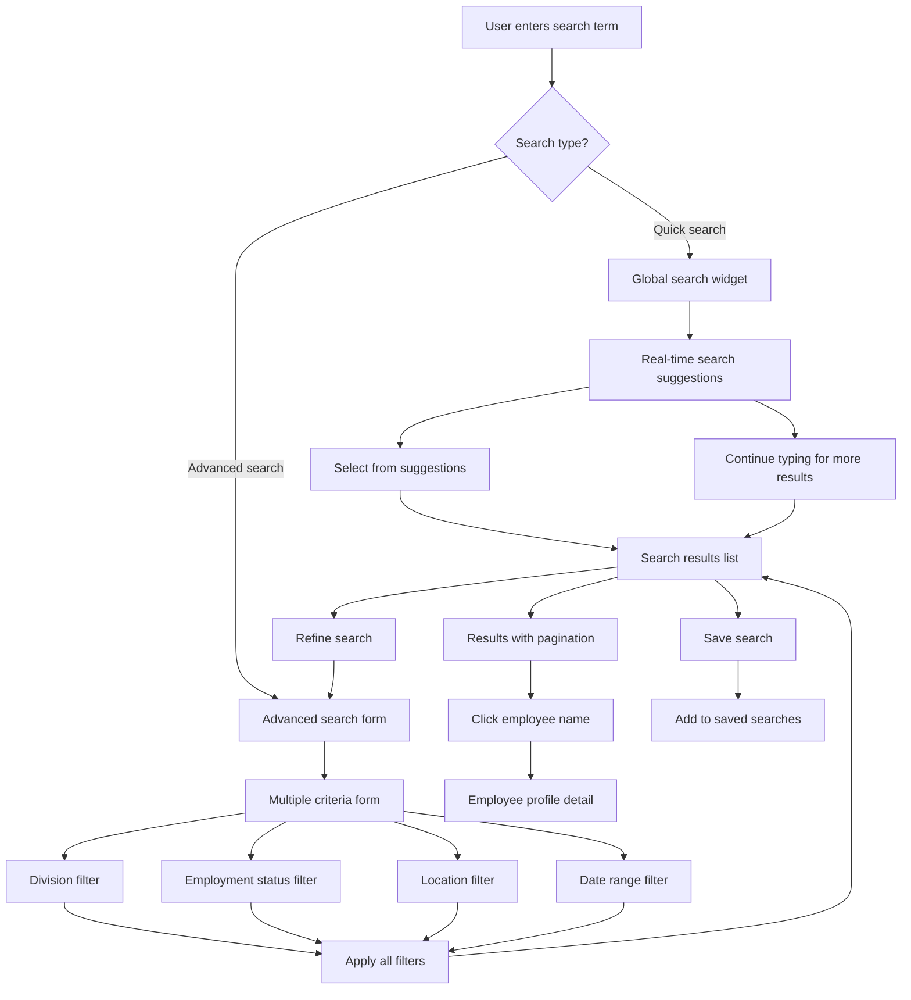
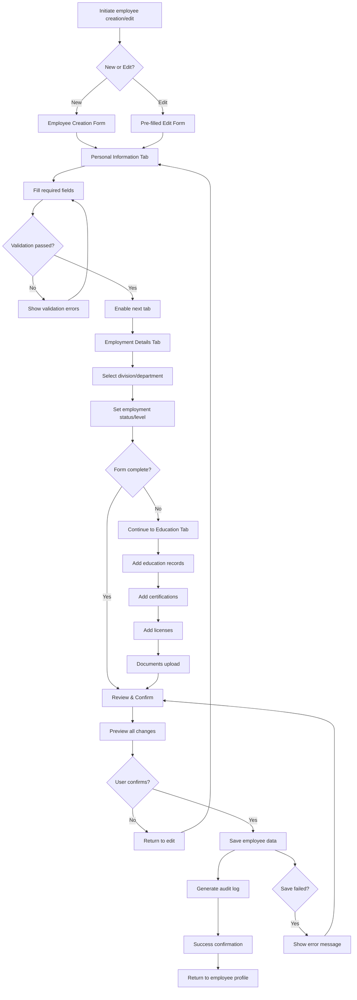
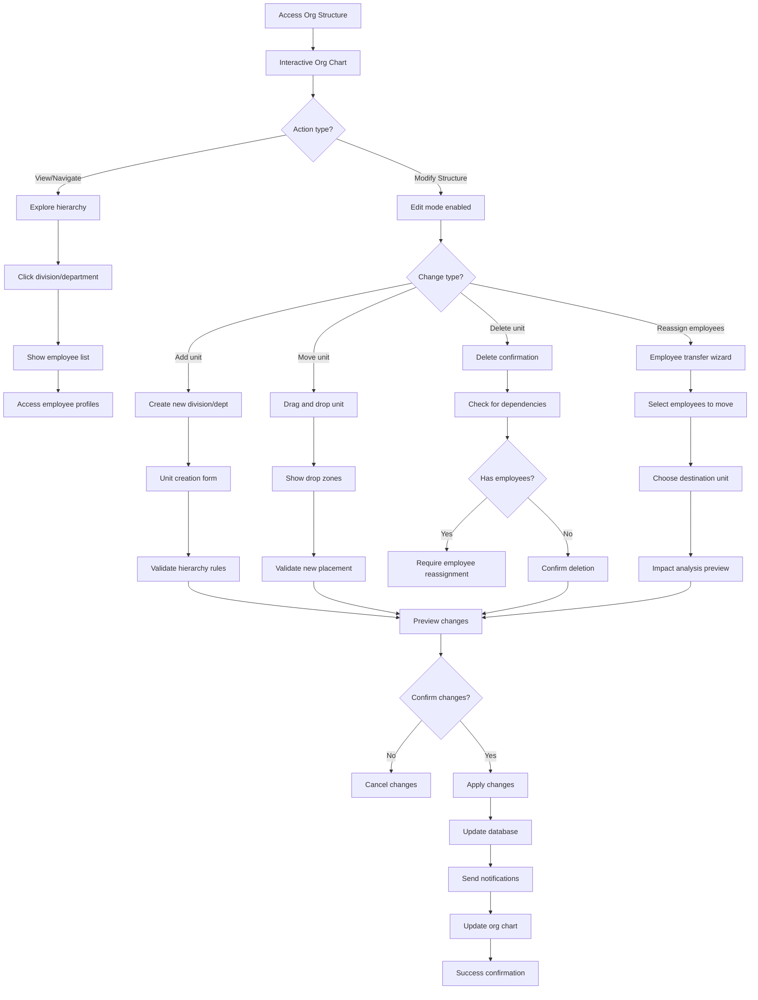

# KAEF HRIS Employee Master Data UI/UX Specification

## Introduction

This document defines the user experience goals, information architecture, user flows, and visual design specifications for KAEF HRIS Employee Master Data's user interface. It serves as the foundation for visual design and frontend development, ensuring a cohesive and user-centered experience for HRD managers overseeing employee data across PT Kimia Farma's extensive pharmaceutical enterprise.

### Overall UX Goals & Principles

#### Target User Personas

- **HRD Manager (Primary):** Strategic HR leaders who need comprehensive oversight across all divisions and subsidiaries. They require executive dashboards, cross-divisional analytics, and organizational management tools. High data literacy, efficiency-focused, need confirmations for critical changes.

- **Division Manager:** Department heads managing employees within specific pharmaceutical business units (Manufacturing, Distribution, Retail, International). Need focused views of their division with limited cross-divisional access. Require quick employee lookup and basic management functions.

- **HR Staff:** Day-to-day HR operations personnel handling employee data entry, profile updates, and routine HR tasks. Need efficient forms, clear validation, and streamlined workflows for bulk operations.

- **Employee (Self-Service):** Employees accessing their own profile data and career information. Limited permissions, mobile-friendly access, focus on personal data review and career path visualization.

#### Usability Goals

- **Efficiency for Power Users:** HRD managers can complete frequent tasks (employee searches, status updates, reports) within 30 seconds with minimal clicks
- **Clarity for Complex Data:** Large datasets (10,000+ employees) presented clearly with effective filtering, sorting, and progressive disclosure
- **Error Prevention:** Confirmation workflows for critical changes (salary, termination, transfers) prevent costly mistakes
- **Mobile Accessibility:** Field managers at factories and retail locations can access essential employee information on tablets/phones
- **Pharmaceutical Context:** Industry-specific workflows (certification tracking, regulatory compliance) feel natural and integrated

#### Design Principles

1. **Data Density with Clarity** - Present comprehensive employee information efficiently while maintaining readability and preventing cognitive overload
2. **Hierarchy-Aware Design** - Interface adapts based on user role and organizational position, showing relevant data and actions
3. **Search-First Philosophy** - Prominent, powerful search capabilities as the primary navigation method for large employee datasets
4. **Progressive Disclosure** - Show essential information immediately, provide easy access to detailed data when needed
5. **Confirmation-Conscious** - Critical actions require clear confirmation with impact preview, especially for organizational changes

### Change Log

| Date       | Version | Description                                          | Author            |
| ---------- | ------- | ---------------------------------------------------- | ----------------- |
| 2025-09-29 | 1.0     | Initial UI/UX Specification for Employee Master Data | Sally (UX Expert) |

## Information Architecture (IA)

### Site Map / Screen Inventory

```mermaid
graph TD
    A[HRIS Dashboard] --> B[Employee Management]
    A --> C[Organizational Structure]
    A --> D[Master Data Management]
    A --> E[Reports & Analytics]
    A --> F[User Profile & Settings]

    B --> B1[Employee Directory]
    B --> B2[Employee Profile Detail]
    B --> B3[Add New Employee]
    B --> B4[Bulk Operations]
    B --> B5[Employee Import/Export]

    B1 --> B1a[Search & Filters]
    B1 --> B1b[Advanced Search]
    B1 --> B1c[Saved Searches]

    B2 --> B2a[Personal Information Tab]
    B2 --> B2b[Employment Details Tab]
    B2 --> B2c[Education & Certifications Tab]
    B2 --> B2d[Career History Tab]
    B2 --> B2e[Documents Tab]
    B2 --> B2f[Audit Trail Tab]

    C --> C1[Organizational Chart]
    C --> C2[Division Management]
    C --> C3[Department Management]
    C --> C4[Subsidiary Structure]
    C --> C5[Location Management]

    C1 --> C1a[Interactive Org Chart]
    C1 --> C1b[Hierarchy View]
    C1 --> C1c[Reporting Relationships]

    D --> D1[Employment Statuses]
    D --> D2[Employee Levels]
    D --> D3[Career Tracks]
    D --> D4[Work Schedule Types]
    D --> D5[Salary Currencies]
    D --> D6[Education Levels]

    E --> E1[Employee Analytics]
    E --> E2[Turnover Reports]
    E --> E3[Career Progression Reports]
    E --> E4[Compliance Reports]
    E --> E5[Custom Report Builder]

    F --> F1[User Profile]
    F --> F2[Preferences]
    F --> F3[Notification Settings]
    F --> F4[Access Permissions]
```

### Navigation Structure

**Primary Navigation:**
Top-level horizontal navigation bar with role-based visibility:

- Dashboard (always visible)
- Employee Management (core module - all authenticated users)
- Organizational Structure (HRD Managers, Division Managers)
- Master Data Management (HRD Managers only)
- Reports & Analytics (HRD Managers, HR Staff with limited access)
- User Profile (always visible)

**Secondary Navigation:**
Left sidebar contextual navigation that adapts based on primary selection:

- Collapses on mobile devices
- Shows quick filters and shortcuts for the current module
- Recent employee searches and bookmarks
- Quick actions based on user role

**Breadcrumb Strategy:**
Hierarchical breadcrumbs for deep navigation paths:

- Always shows: Module > Section > Detail Level
- Example: "Employee Management > Employee Directory > John Doe Profile > Career History"
- Clickable breadcrumbs for quick navigation
- Smart breadcrumbs that understand organizational hierarchy (Division > Department > Employee)

## User Flows

### Flow 1: Employee Search and Discovery

**User Goal:** HRD manager needs to quickly find specific employee(s) from 10,000+ records using various search criteria

**Entry Points:**

- Dashboard search widget
- Employee Directory main search
- Organizational chart employee lookup
- Reports drill-down navigation

**Success Criteria:**

- User finds target employee within 30 seconds
- Search results are relevant and properly filtered
- User can access employee profile with 1-2 clicks from results

#### Flow Diagram

#### Edge Cases & Error Handling:

- No search results found: Suggest alternative search terms and display recent employees
- Too many results (>100): Force user to add more filters with helpful suggestions
- Search timeout: Show partial results with option to continue
- Invalid search criteria: Real-time validation with helpful error messages
- Network connectivity issues: Cache recent searches and show offline indicator

**Notes:** Search must handle Indonesian names, NIK numbers, and pharmaceutical industry terminology. Real-time search suggestions improve efficiency for large datasets.

### Flow 2: Employee Profile Creation and Editing

**User Goal:** HR staff needs to create a new employee profile or update existing employee information with comprehensive data validation

**Entry Points:**

- "Add New Employee" button from Employee Directory
- "Edit Profile" button from Employee Detail view
- Bulk import wizard for multiple employees
- Organizational chart "Add Employee" action

**Success Criteria:**

- Complete employee profile created with all required fields
- Data validation prevents errors and ensures compliance
- User receives clear confirmation of successful save
- Audit trail automatically captures all changes

#### Flow Diagram

#### Edge Cases & Error Handling:

- Required field validation: Clear inline validation with Indonesian language support
- Duplicate employee detection: Check NIK and email before allowing save
- File upload failures: Retry mechanism and format validation for documents
- Session timeout during editing: Auto-save draft and restore on login
- Database constraints: User-friendly error messages for technical validation failures

**Notes:** Form supports Indonesian employment law requirements (NIK, address fields). Progressive disclosure keeps form manageable while capturing comprehensive data.

### Flow 3: Organizational Structure Management

**User Goal:** HRD manager needs to modify organizational structure, reassign employees, and maintain reporting relationships

**Entry Points:**

- Organizational Structure main menu
- Employee profile "Transfer Employee" action
- Dashboard organizational health alerts
- Bulk operations for restructuring

**Success Criteria:**

- Organizational changes applied without breaking reporting relationships
- Affected employees receive notifications of changes
- Historical organizational data preserved for audit purposes
- Impact analysis shows before confirming major changes

#### Flow Diagram

#### Edge Cases & Error Handling:

- Circular reporting relationships: Prevent creation with clear error message
- Manager without reports: Allow but show warning about span of control
- Cross-subsidiary transfers: Additional approval workflow required
- Bulk changes affecting many employees: Staged implementation with rollback option
- Integration with payroll systems: Validate changes don't break existing integrations

**Notes:** Changes require confirmation workflows for critical organizational impacts. System maintains historical organizational data for compliance and audit purposes.

## Wireframes & Mockups

**Primary Design Files:** Recommended Figma workspace with collaborative design system including component library based on existing TailwindCSS and Radix UI patterns, responsive breakpoint variations, interactive prototypes for complex workflows, and design tokens aligned with PT Kimia Farma pharmaceutical industry branding.

### Key Screen Layouts

#### Screen 1: HRD Manager Dashboard

**Purpose:** Executive overview of employee data across all PT Kimia Farma divisions with actionable insights and quick access to critical functions

**Key Elements:**

- **Executive Summary Cards:** Total employees by division (Manufacturing: 3,200, Distribution: 1,800, Retail: 4,500, International: 300, Subsidiaries: 1,200) with trend indicators
- **Organizational Health Metrics:** Turnover rates, promotion activity, succession planning coverage with pharmaceutical industry benchmarks
- **Alert Center:** Certification expiries, compliance issues, high-priority employee changes requiring HRD attention
- **Quick Actions Panel:** Search employees, create reports, access organizational chart, manage master data
- **Recent Activity Feed:** Latest employee changes, approvals pending, and system notifications
- **Performance Indicators:** Key HR metrics with drill-down capability to detailed reports

**Interaction Notes:**
Dashboard widgets are interactive with click-through to detailed views. Real-time updates for critical alerts. Responsive layout collapses to mobile-friendly cards. Role-based widget visibility based on user permissions.

**Design File Reference:** [Figma: HRD Dashboard - Desktop & Mobile Variants]

#### Screen 2: Employee Directory with Advanced Search

**Purpose:** Primary interface for finding and accessing employee records from large dataset with powerful filtering and search capabilities

**Key Elements:**

- **Global Search Bar:** Prominent search with real-time suggestions, recent searches, and saved search shortcuts
- **Advanced Filter Panel:** Collapsible sidebar with filters for division, employment status, location, career track, certification expiry, and custom date ranges
- **Employee Results Grid:** Responsive card/list view showing employee photo, name, position, division, location, and key status indicators
- **Bulk Action Toolbar:** Multi-select capabilities for bulk operations (export, transfer, update status) with role-based visibility
- **Pagination & Performance:** Efficient pagination for 10,000+ records with virtual scrolling and performance indicators
- **Quick Filter Chips:** Applied filters shown as removable chips above results

**Interaction Notes:**
Search supports Indonesian names and pharmaceutical terminology. Advanced filters collapse on mobile. Employee cards include hover states with quick actions. Bulk operations require confirmation workflows.

**Design File Reference:** [Figma: Employee Directory - Search & Filter Layouts]

#### Screen 3: Employee Profile Detail (Tabbed Interface)

**Purpose:** Comprehensive employee information display with edit capabilities, organized for efficient data access and management

**Key Elements:**

- **Employee Header:** Photo, name, employee ID, current position, and employment status with key action buttons (Edit, Transfer, Promote)
- **Tabbed Content Areas:** Personal Info, Employment Details, Education & Certifications, Career History, Documents, Audit Trail
- **Context-Sensitive Actions:** Edit buttons appear based on user permissions, confirmation dialogs for sensitive changes
- **Related Information Sidebar:** Direct reports, manager hierarchy, team members, and recent activity
- **Document Management:** Upload/download interface for employee documents with version control
- **Career Path Visualization:** Timeline view of career progression with future planning integration

**Interaction Notes:**
Tabs maintain state during session. Edit mode shows inline validation. Document uploads support drag-and-drop. Career timeline is interactive with drill-down capabilities.

**Design File Reference:** [Figma: Employee Profile - All Tab Variations]

#### Screen 4: Organizational Chart Interactive View

**Purpose:** Visual representation of PT Kimia Farma's organizational structure with employee management capabilities

**Key Elements:**

- **Hierarchical Tree View:** Interactive org chart showing Board of Directors down to individual employees with zoom/pan controls
- **Division & Subsidiary Panels:** Expandable sections for Manufacturing, Distribution, Retail, International, and subsidiary companies
- **Employee Assignment Interface:** Drag-and-drop employee movement between organizational units with validation
- **Search & Navigation:** Find specific positions or employees within the organizational structure
- **Management Actions:** Add positions, modify reporting relationships, view span of control analytics
- **Geographic Distribution:** Optional map view showing employee distribution across PT Kimia Farma's locations

**Interaction Notes:**
Responsive zoom for different screen sizes. Touch-friendly controls for tablet use. Real-time collaboration for organizational changes. Undo/redo capabilities for structure modifications.

**Design File Reference:** [Figma: Organizational Chart - Interactive Prototype]

#### Screen 5: Master Data Management Interface

**Purpose:** Configuration interface for HRD managers to maintain employment parameters and organizational settings

**Key Elements:**

- **Master Data Categories:** Tabbed interface for Employment Statuses, Employee Levels, Career Tracks, Work Schedule Types, etc.
- **CRUD Operations:** Create, read, update, delete interfaces for each master data type with validation
- **Bulk Import/Export:** Excel-based import/export with template download and validation feedback
- **Usage Analytics:** Show which master data items are in use and by how many employees
- **Audit History:** Track changes to master data with user attribution and rollback capabilities
- **Dependency Warnings:** Alert users when attempting to delete master data items in use

**Interaction Notes:**
Changes require confirmation workflows. Bulk operations show progress indicators. Form validation prevents invalid configurations. Export generates formatted Excel files.

**Design File Reference:** [Figma: Master Data Management - Configuration Screens]

## Component Library / Design System

**Design System Approach:** Build upon existing KAEF HRIS design system using TailwindCSS and Radix UI as the foundation, extending it with specialized HR and pharmaceutical industry components. This approach ensures consistency with current system while adding sophisticated data management capabilities needed for 10,000+ employee records.

### Core Components

#### Component: Employee Data Card

**Purpose:** Standardized display component for employee information across different contexts (directory, search results, org chart)

**Variants:**

- **Compact:** List view with essential info (photo, name, position, status)
- **Standard:** Card view with additional details (division, location, contact)
- **Detailed:** Expanded view with summary metrics (tenure, team size, recent activity)
- **Mobile:** Touch-optimized layout for tablet/phone access

**States:**

- **Default:** Standard employee information display
- **Hover:** Reveals quick action buttons (view profile, edit, contact)
- **Selected:** Multi-select state for bulk operations
- **Loading:** Skeleton loading state for performance optimization
- **Error:** Invalid employee data or access permission issues

**Usage Guidelines:** Use consistent employee photo sizing (48px standard, 32px compact). Include status indicators (active, inactive, on-leave) with color coding. Support Indonesian name formatting and pharmaceutical industry titles.

#### Component: Advanced Search Interface

**Purpose:** Powerful search component for finding employees from large datasets with multiple filter criteria

**Variants:**

- **Global Search:** Header search bar with autocomplete and recent searches
- **Advanced Filter Panel:** Comprehensive filtering with nested criteria
- **Quick Filter Chips:** Applied filters shown as removable tags
- **Saved Search Menu:** User-defined search templates with sharing capabilities

**States:**

- **Empty:** Placeholder with search suggestions and popular filters
- **Typing:** Real-time search suggestions with highlight matching
- **Results:** Search results with relevance scoring and pagination
- **No Results:** Helpful suggestions and alternative search options
- **Loading:** Progressive loading with partial results display

**Usage Guidelines:** Support Indonesian language search terms. Include pharmaceutical industry terminology in autocomplete. Maintain search history per user session. Optimize for 10,000+ employee dataset performance.

#### Component: Organizational Hierarchy Visualizer

**Purpose:** Interactive component for displaying and managing PT Kimia Farma's complex organizational structure

**Variants:**

- **Tree View:** Traditional hierarchical tree with expand/collapse nodes
- **Interactive Chart:** Draggable org chart with zoom and pan controls
- **List View:** Flat list view with indentation showing hierarchy levels
- **Geographic Map:** Location-based view of organizational distribution

**States:**

- **View Mode:** Read-only exploration of organizational structure
- **Edit Mode:** Interactive modification with drag-and-drop capabilities
- **Validation:** Real-time validation of organizational changes
- **Saving:** Progress indication during organizational updates
- **Conflict:** Warning states for invalid hierarchy configurations

**Usage Guidelines:** Handle subsidiary company relationships with visual distinction. Support both Board-level and operational-level views. Implement touch-friendly controls for tablet access. Maintain performance with large organizational datasets.

#### Component: Career Path Timeline

**Purpose:** Visual representation of employee career progression within pharmaceutical industry context

**Variants:**

- **Horizontal Timeline:** Left-to-right career progression view
- **Vertical Timeline:** Top-to-bottom chronological career history
- **Interactive Planner:** Future career path planning with goals and milestones
- **Comparison View:** Side-by-side career path comparisons for benchmarking

**States:**

- **Historical:** Display completed career moves and achievements
- **Current:** Highlight current position with context and metrics
- **Planned:** Show future career goals and development plans
- **Interactive:** Edit mode for career planning and goal setting
- **Analysis:** Pattern recognition and career path suggestions

**Usage Guidelines:** Include pharmaceutical industry-specific career tracks (R&D, manufacturing, regulatory, commercial). Support both PT Kimia Farma internal moves and external experience. Integrate with performance data and certification requirements.

#### Component: Confirmation Dialog System

**Purpose:** Consistent confirmation patterns for critical HR operations that require user validation

**Variants:**

- **Simple Confirmation:** Basic yes/no confirmation for standard operations
- **Impact Preview:** Show change impact before confirmation (affected employees, budget implications)
- **Multi-Step Confirmation:** Complex changes requiring multiple validation steps
- **Bulk Operation Confirmation:** Special handling for operations affecting multiple employees

**States:**

- **Warning:** Caution for potentially problematic changes
- **Critical:** High-impact changes requiring additional verification
- **Success:** Confirmation of successful operation completion
- **Error:** Failure states with recovery options and support information
- **Processing:** Progress indication during operation execution

**Usage Guidelines:** Use clear, non-technical language for confirmation messages. Show specific impact details (number of employees affected, budget changes). Provide undo capabilities where possible. Include relevant policy or compliance information.

## Branding & Style Guide

### Visual Identity

**Brand Guidelines:** PT Kimia Farma official brand assets from 1817 - Indonesia's first and largest pharmaceutical company

### Color Palette (PT Kimia Farma Official)

| Color Type | Hex Code                           | Brand Name            | Usage                                                                   |
| ---------- | ---------------------------------- | --------------------- | ----------------------------------------------------------------------- |
| Primary    | #003A78                            | PT Kimia Farma Blue   | Main navigation, headers, primary actions, brand identity               |
| Secondary  | #F49200                            | PT Kimia Farma Orange | Highlights, active states, call-to-action buttons, interactive elements |
| Success    | #10B981                            | Custom Success Green  | Confirmations, active employment status, completed tasks                |
| Warning    | #F59E0B                            | Custom Warning Amber  | Cautions, pending approvals, certification expiry alerts                |
| Error      | #EF4444                            | Custom Error Red      | Errors, destructive actions, critical alerts                            |
| Neutral    | #64748B, #94A3B8, #CBD5E1, #F1F5F9 | Custom Neutral Grays  | Text hierarchy, borders, backgrounds, data tables                       |

### Typography

#### Font Families

- **Primary:** Source Sans Pro (Official PT Kimia Farma title font, excellent for pharmaceutical industry professionalism)
- **Secondary:** Inter (Enhanced readability for dense HR data displays, Indonesian language support)
- **Monospace:** JetBrains Mono (employee IDs, data codes, technical information)

#### Type Scale (Source Sans Pro Primary)

| Element | Size            | Weight         | Line Height |
| ------- | --------------- | -------------- | ----------- |
| H1      | 2.25rem (36px)  | 700 (Bold)     | 1.2         |
| H2      | 1.875rem (30px) | 600 (Semibold) | 1.3         |
| H3      | 1.5rem (24px)   | 600 (Semibold) | 1.4         |
| Body    | 1rem (16px)     | 400 (Regular)  | 1.5         |
| Small   | 0.875rem (14px) | 400 (Regular)  | 1.4         |

### Iconography

**Icon Library:** Tabler Icons (consistent with Radix UI ecosystem, pharmaceutical-appropriate, comprehensive coverage)

**Usage Guidelines:**

- 24px standard size for interface icons, 16px for inline/small contexts
- Consistent stroke width (1.5px) across all icons
- Pharmaceutical industry icons: pills, medical cross, lab equipment, certificates for relevant contexts
- Organizational icons: building, users, hierarchy, location markers
- Action icons: edit, delete, search, filter, export with clear visual language

### Spacing & Layout

**Grid System:** 12-column CSS Grid with TailwindCSS spacing utilities

**Spacing Scale:** TailwindCSS spacing scale (4px base unit: 0.5, 1, 1.5, 2, 2.5, 3, 4, 5, 6, 8, 10, 12, 16, 20, 24, 32, 40, 48, 56, 64)

## Accessibility Requirements

### Compliance Target

**Standard:** WCAG 2.1 AA compliance for professional HR software, with additional considerations for Indonesian users and pharmaceutical industry requirements

### Key Requirements

#### Visual:

- Color contrast ratios: 4.5:1 minimum for normal text, 3:1 for large text, ensuring PT Kimia Farma brand colors (#003A78, #F49200) meet accessibility standards
- Focus indicators: Clear, 2px solid outline with high contrast for keyboard navigation through complex employee data forms
- Text sizing: Scalable text up to 200% without horizontal scrolling, critical for HR managers reviewing detailed employee information

#### Interaction:

- Keyboard navigation: Complete keyboard accessibility for all functions including employee search, profile editing, and organizational chart navigation
- Screen reader support: Semantic HTML structure with proper ARIA labels for complex HR data tables and employee status indicators
- Touch targets: Minimum 44px touch targets for mobile access by field managers at factories and retail locations

#### Content:

- Alternative text: Descriptive alt text for employee photos, organizational charts, and career path visualizations
- Heading structure: Logical heading hierarchy (H1-H6) for employee profiles and HR documentation navigation
- Form labels: Clear, descriptive labels for all employee data fields with error message association

### Testing Strategy

**Automated Testing:** axe-core integration, WAVE tool validation, color contrast analyzers, keyboard navigation testing

**Manual Testing:** Screen reader testing with NVDA and JAWS, mobile accessibility testing, Indonesian language testing, cognitive load testing

**User Testing:** Testing with visually impaired employees, field manager mobile testing, Indonesian language accessibility validation

## Responsiveness Strategy

### Breakpoints

| Breakpoint | Min Width | Max Width | Target Devices                                                       |
| ---------- | --------- | --------- | -------------------------------------------------------------------- |
| Mobile     | 320px     | 767px     | Smartphones for field managers, emergency HR access                  |
| Tablet     | 768px     | 1023px    | iPads/Android tablets for store managers, factory supervisors        |
| Desktop    | 1024px    | 1439px    | Standard office workstations for HRD staff, HR administrators        |
| Wide       | 1440px    | -         | Large monitors for HRD managers, executive dashboards, data analysis |

### Adaptation Patterns

#### Layout Changes:

**Desktop to Tablet:** Side navigation collapses to hamburger menu, employee cards reorganize from 3-column to 2-column grid, advanced filters move to slide-out panel

**Tablet to Mobile:** Master-detail view becomes stacked navigation, data tables become horizontally scrollable cards, search filters become modal overlays

#### Navigation Changes:

**Desktop:** Persistent sidebar navigation with secondary menu expansion
**Tablet:** Collapsible sidebar with gesture-friendly touch targets (minimum 44px)
**Mobile:** Bottom navigation bar for primary functions, hamburger menu for secondary options

#### Content Priority:

**Mobile-First Content Hierarchy:**

1. Employee search and basic contact information
2. Employment status and key details
3. Quick actions (call, email, basic updates)
4. Detailed profile information (accessible via drill-down)

#### Interaction Changes:

**Touch Optimization (Mobile/Tablet):**

- Minimum 44px touch targets for all interactive elements
- Swipe gestures for navigation between employee profiles
- Pull-to-refresh for employee list updates
- Long-press for context menus and bulk selection

**Mouse Optimization (Desktop):**

- Hover states for detailed information preview
- Right-click context menus for power user shortcuts
- Keyboard shortcuts for efficient navigation
- Drag-and-drop for organizational chart management

## Animation & Micro-interactions

### Motion Principles

Subtle, purposeful animations that enhance usability without distracting from critical HR operations. Animations support task completion and provide feedback for data-intensive workflows.

### Key Animations

- **Employee Card Hover:** Subtle elevation and shadow increase (Duration: 200ms, Easing: ease-out)
- **Search Results Loading:** Skeleton loading animation for employee cards (Duration: 1.5s shimmer, Easing: linear)
- **Form Field Validation:** Smooth error state transitions with color change (Duration: 300ms, Easing: ease-in-out)
- **Navigation Transitions:** Smooth slide transitions between major sections (Duration: 250ms, Easing: cubic-bezier(0.4, 0, 0.2, 1))
- **Data Table Sorting:** Smooth row reordering animation (Duration: 400ms, Easing: ease-out)
- **Modal Entry/Exit:** Backdrop fade with modal slide-in from center (Duration: 300ms, Easing: ease-out)
- **Success Confirmations:** Gentle check mark animation with color pulse (Duration: 600ms, Easing: ease-in-out)
- **Page Transitions:** Smooth fade between major page sections (Duration: 200ms, Easing: ease-in-out)

## Performance Considerations

### Performance Goals

- **Dashboard Load:** Under 2 seconds for initial HRD dashboard with 10,000+ employee overview
- **Employee Search Response:** Under 200ms for search result display with real-time filtering
- **Profile Page Load:** Under 1 second for complete employee profile with all tabs
- **Animation Performance:** Consistent 60fps for all micro-interactions and transitions

### Design Strategies

**Data Loading Optimization:** Progressive loading with skeleton screens for employee lists, lazy loading for detailed profile tabs, virtual scrolling for large datasets

**Image Optimization:** Compressed employee photos with WebP format support, placeholder images during loading, responsive image sizing based on device capabilities

**Component Performance:** Memoized React components for employee cards, efficient re-rendering strategies for large lists, optimized bundle splitting for feature modules

## Next Steps

### Immediate Actions

1. **Stakeholder Review and Approval**

   - Present UI/UX specification to PT Kimia Farma HRD leadership for validation
   - Review design decisions with key user representatives (HRD managers, HR staff, field managers)
   - Validate PT Kimia Farma brand integration and pharmaceutical industry appropriateness
   - Confirm accessibility requirements meet organizational standards

2. **Design System Development**

   - Create Figma design system library with PT Kimia Farma official colors (#003A78, #F49200)
   - Develop comprehensive component library extending TailwindCSS and Radix UI
   - Build interactive prototypes for complex workflows (employee search, org chart management)
   - Create responsive design variations for desktop, tablet, and mobile breakpoints

3. **Technical Architecture Collaboration**

   - Handoff UI/UX specification to Design Architect for technical implementation planning
   - Review component architecture requirements with development team
   - Validate performance requirements against Laravel/React infrastructure capabilities
   - Plan integration strategy with existing KAEF HRIS brownfield architecture

4. **User Testing Preparation**

   - Plan usability testing sessions with actual HRD managers and HR staff
   - Prepare testing scenarios based on critical user flows documented in specification
   - Schedule accessibility testing with Indonesian language screen readers
   - Design mobile testing protocol for field manager use cases

5. **Implementation Planning**
   - Break down UI/UX specification into development sprints aligned with PRD epics
   - Prioritize component development based on Epic 1 (Foundation) requirements
   - Plan design token integration with existing TailwindCSS configuration
   - Schedule design review checkpoints during development phases

### Design Handoff Checklist

- ✅ All user flows documented
- ✅ Component inventory complete
- ✅ Accessibility requirements defined
- ✅ Responsive strategy clear
- ✅ Brand guidelines incorporated
- ✅ Performance goals established

### Success Metrics for Implementation

**User Experience Metrics:**

- Employee search task completion time <30 seconds
- Profile editing accuracy >95% on first attempt
- Mobile accessibility satisfaction score >4.5/5 from field managers
- Desktop efficiency improvement >40% over current system

**Technical Performance Metrics:**

- Dashboard load time <2 seconds (98th percentile)
- Search result response time <200ms (95th percentile)
- Component rendering performance >60fps
- Mobile lighthouse accessibility score >95

**Business Impact Metrics:**

- HRD manager task efficiency improvement >50%
- Reduction in employee data errors >30%
- Field manager mobile usage adoption >80%
- User satisfaction score >4.7/5 across all personas
